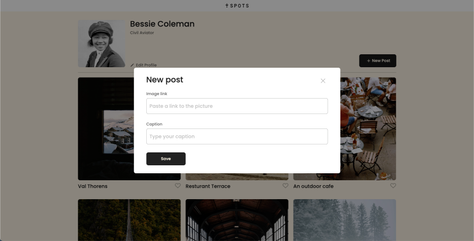
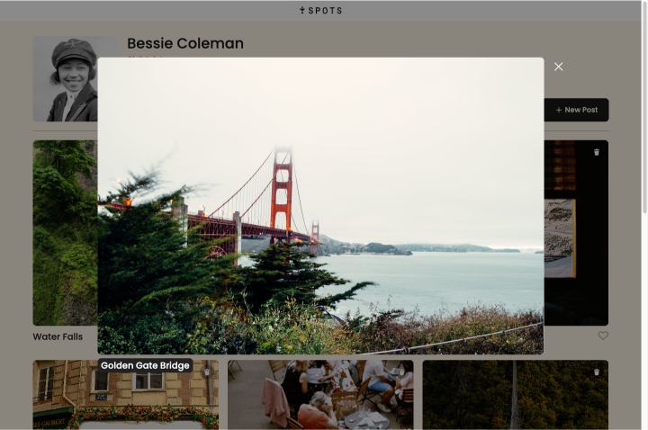

# Spots

A simple responsive image sharing website

### Description

Spots is a responsive image sharing web application that allows users to manage a personal profile, view scenic cards, and create new posts. The project contains modal popups, form validation, DOM manipulation, and BEM methodology.

## Features

- Edit Profile Modal
- Add New Post Modal
- Like Button Toggle
- Delete Card Functionality
- Image Preview Modal
- Form Validation
- Submit Button Disable/Enable
- Modal Close on ESC / Overlay Click
- Responsive Layout

## Tech stack

- HTML
- CSS
- BEM methodology and file structure
- JavaScript
- Responsive Design through media quieries
- Figma Design Interpretation
- Repository tracking through GitHub
- Deployment via GitHub pages

## Deployment

This webpage is deployed into GitHub Pages: [Deployment Link](https://prakruthin.github.io/se_project_spots/index.html)

## Future scope

- SQL connection to store likes and user information.

## Screenshots and Video

Video Link: [Video](https://drive.google.com/file/d/1W2rfSHymiSZul-9Je0l9duxUCwLcJRsN/view?usp=drive_link)

Screenshots:

