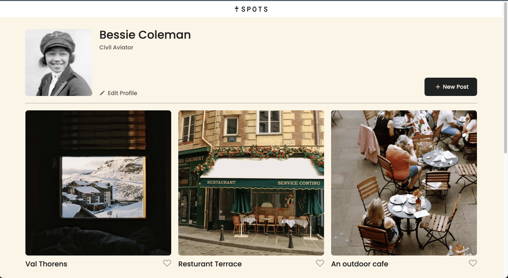
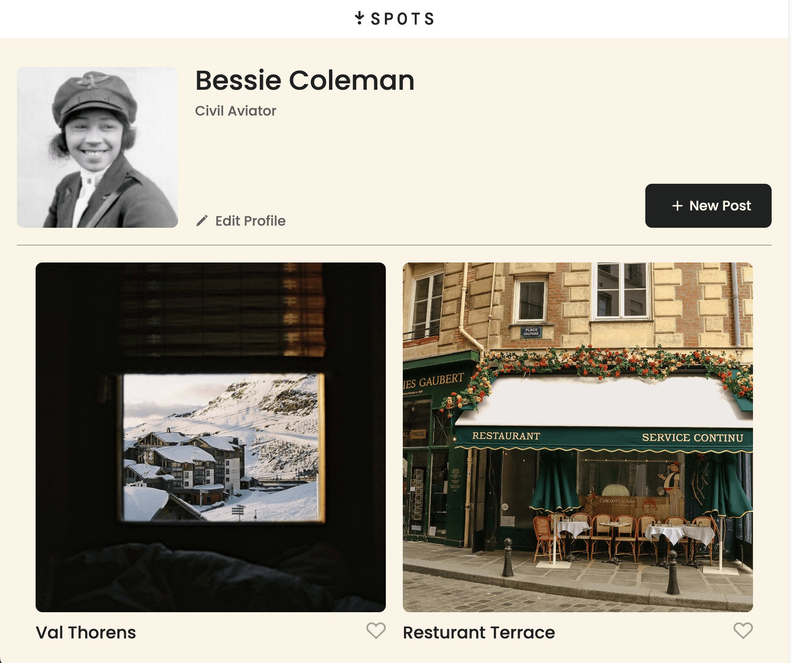
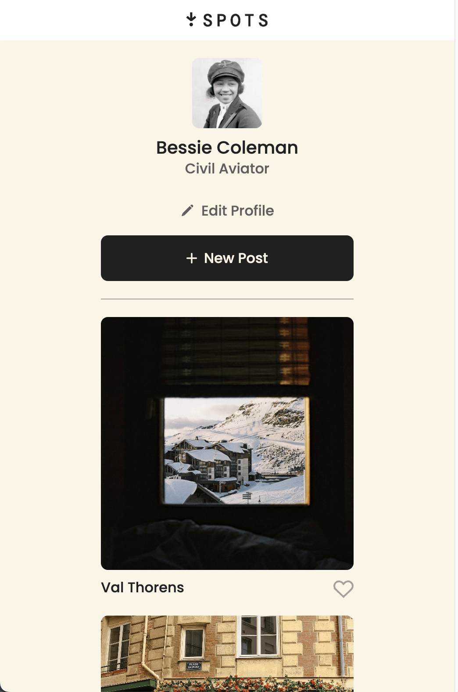

# Spots

A simple responsive image sharing website

### Description

Spots is a minimal photo-sharing website where users can view and share their favorite photos. This website is designed using responsive design- optimal for desktop, tablet, and mobile phone. The site offers a user profile section for user introduction, a gallery for image sharing, and interactive buttons for liking and adding new posts.

## Tech stack

- HTML
- CSS
- BEM methodology and file structure
- Responsive Design through media quieries
- Layout understanding from Figma Design
- Repository tracking through GitHub
- Deployment via GitHub pages

## Deployment

This webpage is deployed into GitHub Pages: [Deployment Link](https://prakruthin.github.io/se_project_spots/index.html)

## Future scope

- Add JavaScript
- SQL connection to store likes and user information.

## Screenshots and Video

Video Link: [Video](https://drive.google.com/file/d/1W2rfSHymiSZul-9Je0l9duxUCwLcJRsN/view?usp=drive_link)

Screenshots:

