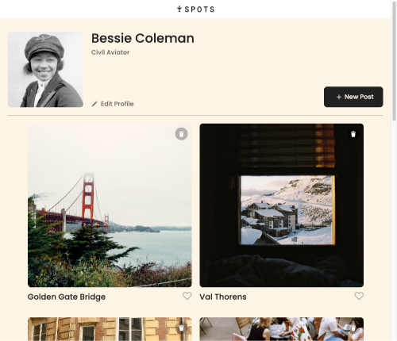
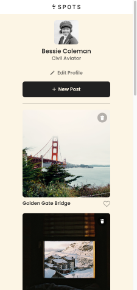
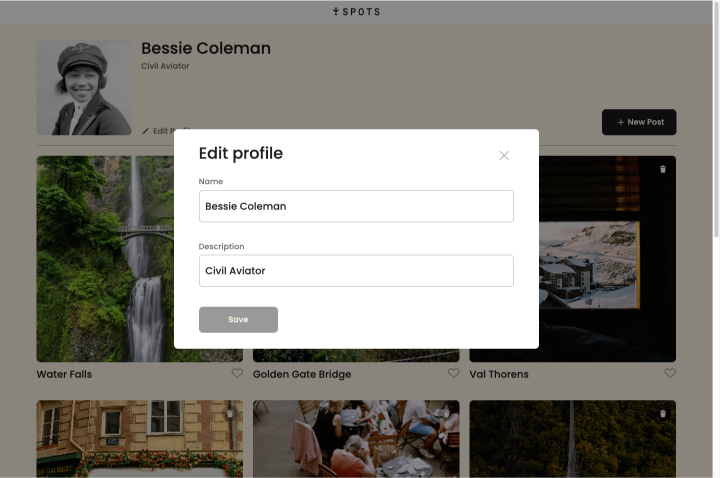

# Spots

A simple responsive image sharing website

### Description

Spots is a responsive image sharing web application that allows users to manage a personal profile, view scenic cards, and create new posts. The project contains modal popups, form validation, DOM manipulation, and BEM methodology.

## Features

- User Profile: View and edit your name, description, and avatar.
- Photo Cards: View a gallery of photo cards, add new cards, like/unlike cards, and delete your own cards.
- Responsive Design: Works well on both desktop and mobile devices.
- Form Validation: All forms are validated on the client side.
- API Integration: All data is fetched from and saved to a remote server.

## Tech stack

- HTML5, CSS3 (Flexbox, Grid, BEM methodology)
- JavaScript (ES6+)
- Webpack (for bundling)
- REST API
- Responsive Design through media quieries
- Figma Design Interpretation
- Repository tracking through GitHub
- Deployment via GitHub pages

## Deployment

This webpage is deployed into GitHub Pages: [Deployment Link](https://prakruthin.github.io/se_project_spots/index.html)

## Future scope

- SQL connection to store likes and user information.

## Screenshots and Video

Video Link: [Video](https://drive.google.com/file/d/1W2rfSHymiSZul-9Je0l9duxUCwLcJRsN/view?usp=drive_link)

Screenshots:

